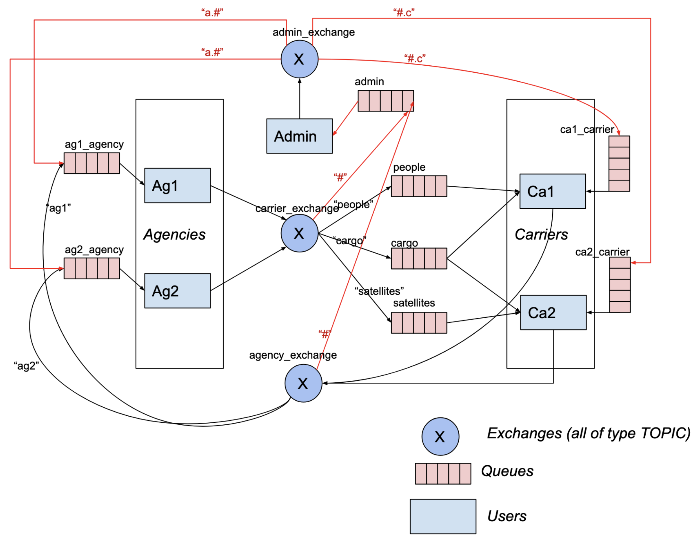

# RabbitMQ Space agency management system

Assignment from Distributed Systems course. A RabbitMQ-based console app with Carrier, Agency and Admin modes.

Agencies request services from Carriers, each handling two out of three kinds of services.
Requests are equally distributed among the Carriers. Admin receives copies of all messages passed in the system,
as well as can send custom messages to Agencies and Carriers.

### Diagram

